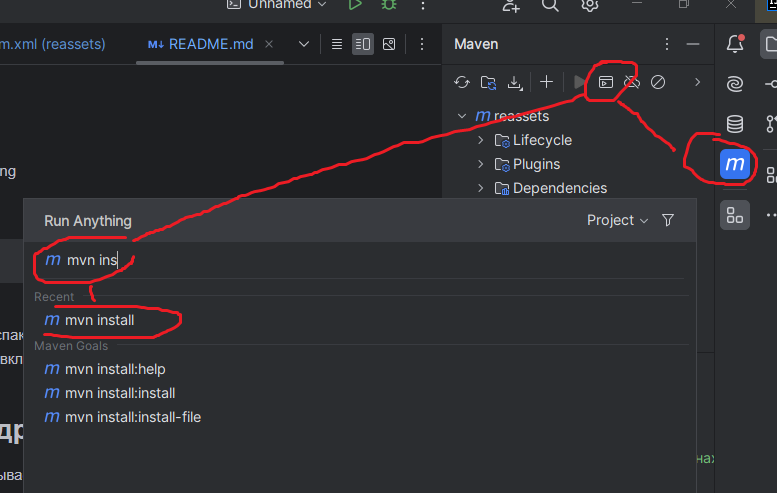
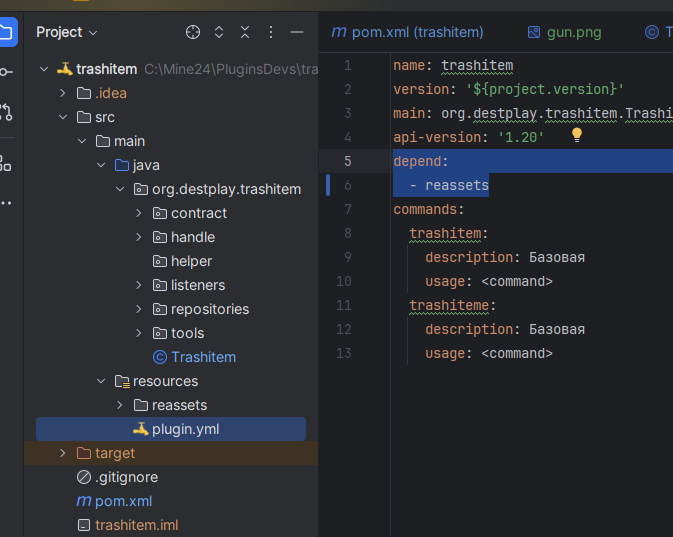
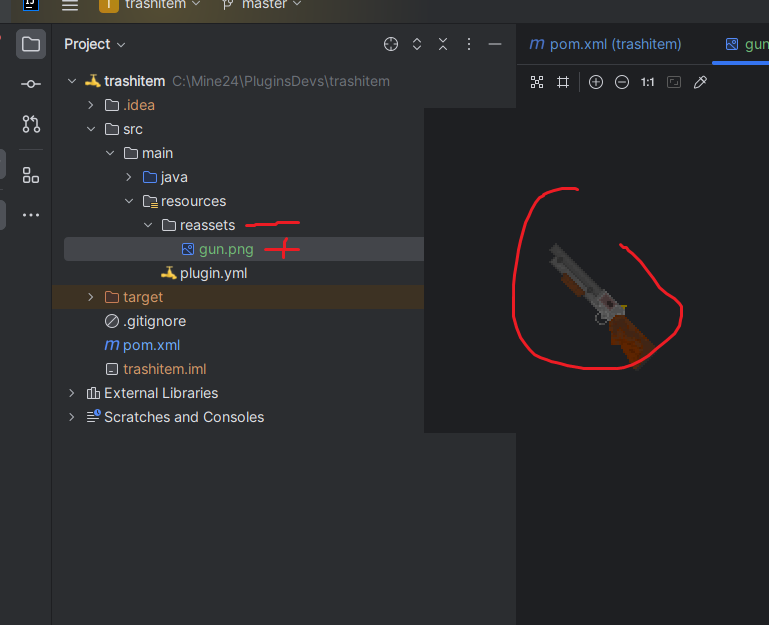

<h1 align="center">
  <br>
  
  <br>
  ReAssets
  <br>
</h1>

<h4 align="center">
Bukkit плагин для ресурсов
</h4>

## Установка

Скачивайте последний релиз плагина закидываете в plugins. Запускаете сервер.

В папке plugins\reassets появится папка **resourcepack** это будет ресурспаком. Можете заменить содержимое своим
ресурспаком.

```bash
# Копируем
$ git  https://github.com

# Депенды 

```

## Использование

У вас есть какой-то плагин и у него есть своя папка, например plugins\examle

Внутри нужно создать папку plugins\reassets

И закинуть в неё картинки итемов
<BR> plugins/reassets/test.png
<BR> plugins/reassets/other_item.png
<BR> plugins/reassets/other_item_eat.png
<BR> plugins/reassets/other_item_sword.png

На сервере введите команду
> /reassets generated

<BR> После этого плагин соберет ресурспак из картинок ваших плагинов и отправить в файловое хранилище, если опция включена

## Использование в других плагинах

Скачиваем этот репозиторий, открываем проект прогружаем себе мавен этого проекта


В своем проекта подключаем зависимость в pom файле:

    <dependency>
      <groupId>org.slavawins</groupId>
      <artifactId>reassets</artifactId>
      <version>v1.0v-1.20.1-SNAPSHOT</version>
    </dependency>

<BR><BR>
Затем добавляем зависимость плагин


        depend:
        - reassets


<BR><BR>
В своем плагины добавляем в папку resources - папку "reassets". В неё закидываем файл картинки итема.
<BR><BR>



В onEnable добавляем распаковку ваших картинок в папку вашего плагина:

    // from import org.slavawins.reassets.integration.ResourceExtractor;

    @Override
    public void onEnable() { 
        ResourceExtractor.extract(this, "reassets");
    ....

<BR><BR>
Запускаем сервер. И видим что в папку плагина на сервере переместилась ваша папка с картинкой: \plugins\trashitem\xreassets

Далее вводим команду генерации итемов:
> /reassets generated

Затем выведим список итемов:
> /reassets list


 