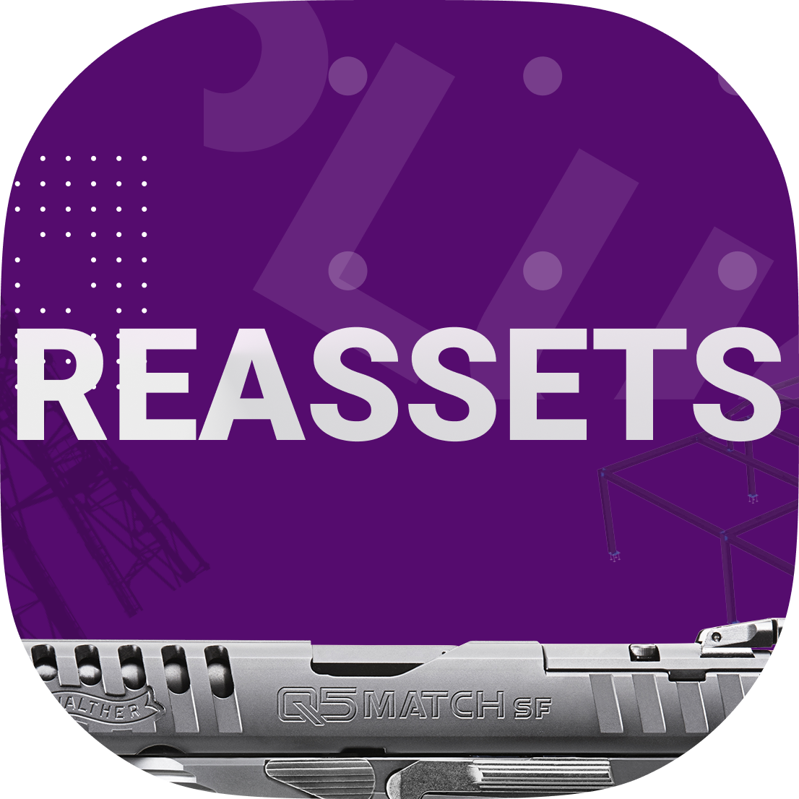

<h1 align="center">
  <br>
  
  <br>
  ReAssets
  <br>
</h1>

<h4 align="center">
Bukkit плагин для ресурсов
</h4>

## Установка

Скачивайте последний релиз плагина закидываете в plugins. Запускаете сервер.

В папке plugins\reassets появится папка **resourcepack** это будет ресурспаком. Можете заменить содержимое своим
ресурспаком.

```bash
# Копируем
$ git  https://github.com

# Депенды 

```


## Использование
У вас есть какой-то плагин и у него есть своя папка, например plugins\examle

Внутри нужно создать папку plugins\reassets

И закинуть в неё картинки итемов
<BR> plugins/reassets/test.png
<BR> plugins/reassets/other_item.png
<BR> plugins/reassets/other_item_eat.png
<BR> plugins/reassets/other_item_sword.png

На сервере введите команду 
> /reassets generated

<BR> После этого плагин соберет ресурспак из картинок ваших плагинов и отправить в файловое хранилище, если опция включена


## License

MIT

--- 